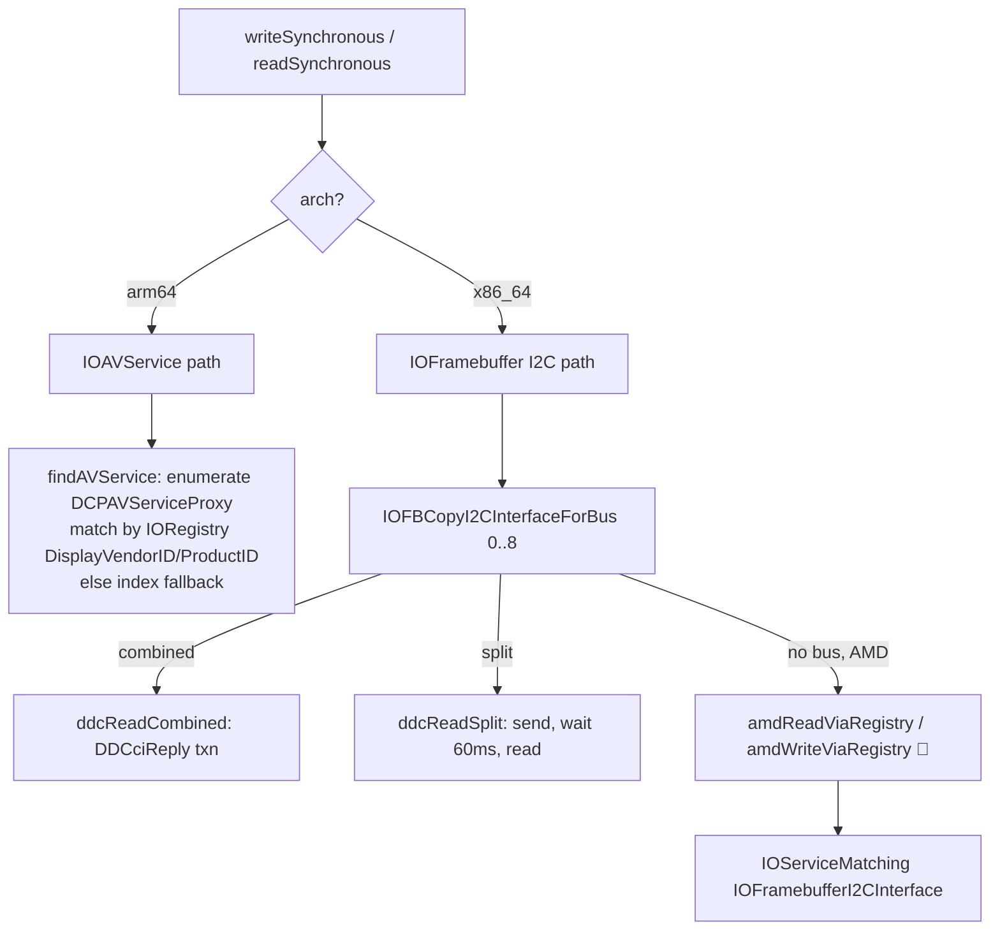

# FreeDisplay — Architecture

A menu-bar macOS app that controls displays directly (brightness, contrast, volume,
resolution, HiDPI, color, virtual displays) as a free alternative to BetterDisplay.

> **Scope & accuracy.** This document was written by reading the Swift sources under
> `FreeDisplay/`. Where the older `docs/codemap/*` notes disagree with the current
> code, the code wins (see [§10 Known drift](#10-known-drift-codemap-vs-code)).
> Items introduced by the fork (asymysh, commits `e0ff910` and `a65c9b8`) are marked
> **🍴 fork addition** inline.

---

## Table of Contents

1. [High-level overview](#1-high-level-overview)
2. [App lifecycle & entry](#2-app-lifecycle--entry)
3. [Data model](#3-data-model)
4. [Service layer](#4-service-layer)
5. [The DDC/CI subsystem in depth](#5-the-ddcci-subsystem-in-depth)
6. [View layer](#6-view-layer)
7. [Private / undocumented APIs](#7-private--undocumented-apis)
8. [Concurrency & threading model](#8-concurrency--threading-model)
9. [Build system](#9-build-system)
10. [Known drift (codemap vs code)](#10-known-drift-codemap-vs-code)

---

## 1. High-level overview

FreeDisplay is a **SwiftUI app with a `Settings` scene placeholder** whose real UI is a
menu-bar `NSStatusItem` + `NSPopover` driven by an `AppDelegate`. It has **zero
third-party dependencies** — everything is built on Apple frameworks (CoreGraphics,
IOKit, AppKit, ColorSync, ServiceManagement) plus a handful of **private / undocumented
APIs** declared in a bridging header or resolved at runtime via `dlopen`/`@_silgen_name`.

The design is roughly **MVVM**:

- `DisplayInfo` is a per-display `@Published` `ObservableObject` (the "view model").
- `DisplayManager` (an `@EnvironmentObject`) owns the `[DisplayInfo]` array and is the
  single source of truth for display state.
- ~22 stateless **singleton services** (`XxxService.shared`) each own one system concern
  and talk to the OS APIs. Views call services; services mutate `DisplayInfo`.

```mermaid
graph TD
    App[FreeDisplayApp @main] --> AD[AppDelegate<br/>NSStatusItem + NSPopover]
    AD --> DM[DisplayManager<br/>@Published displays]
    DM --> DI[DisplayInfo per display]
    AD --> MBV[MenuBarView root]
    MBV --> DCC[DisplayControlCard 🍴]
    DCC --> BS[BrightnessService]
    DCC --> CS[ContrastService 🍴]
    DCC --> VS[VolumeService 🍴]
    DCC --> GS[GammaService]
    BS --> DDC[DDCService]
    CS --> DDC
    VS --> DDC
    DDC -->|Apple Silicon| IOAV[IOAVService]
    DDC -->|Intel / AMD| I2C[IOFramebuffer I2C]
```

---

## 2. App lifecycle & entry

**`App/FreeDisplayApp.swift`** — the `@main` `App`. Its `body` is deliberately a hidden
`Settings { EmptyView() }` scene. The comment explains why: `MenuBarExtra(.window)`
silently degrades to `.menu` style on some hardware (notably Hackintosh), so the app
uses an AppKit `NSStatusItem` + `NSPopover` instead, wired up in the delegate.

**`App/AppDelegate.swift`** (`@NSApplicationDelegateAdaptor`) does the real work:

- **Single-instance guard** — terminates if another copy with the same bundle ID is
  already running.
- Creates the shared `DisplayManager` (on the main thread).
- Builds the `NSStatusItem` (SF Symbol `display`) whose button toggles the popover.
- Hosts `MenuBarView().environmentObject(displayManager)` inside an
  `NSHostingController` in a `.transient` `NSPopover`; a global left/right-mouse-down
  monitor closes it on outside click.
- Starts `BrightnessKeyService.shared.start()` (media-key interception).
- Registers a **wake-from-sleep** observer (`NSWorkspace.didWakeNotification`) that, after
  a 2 s settle delay, refreshes displays and re-applies software brightness, gamma, and
  saved resolution modes.
- On first launch, defaults `fd.arrangement.externalAbove = true` and, after 2 s, calls
  `arrangeExternalAboveBuiltin()`.
- On terminate: removes the wake observer, stops the key tap, and destroys all virtual
  displays.

The `LSUIElement`/`INFOPLIST_KEY_LSUIElement` flag makes it an accessory (no Dock icon).

---

## 3. Data model

All three model types live in `Models/`.

### `DisplayInfo` (`@MainActor`, `ObservableObject`)
The per-display model. Immutable identity fields (`displayID`, `vendorNumber`,
`modelNumber`, `serialNumber`) plus `@Published` mutable state driven by the services:
`name`, `isBuiltin`, `isMain`, `isOnline`, `isEnabled`, `bounds`, `pixelWidth/Height`,
`brightness`, `contrast` **🍴**, `volume` **🍴**, `isMuted` **🍴**, `colorTemperature`,
`availableModes`, `currentDisplayMode`, and a raw `ddcValues` map.

- `displayUUID` — a stable identity from `CGDisplayCreateUUIDFromDisplayID` (falls back to
  a `vendor-model-serial` string). Used to match presets across sleep/wake even when
  macOS reassigns the `CGDirectDisplayID`.
- `nativeResolution` — highest non-HiDPI mode.
- `loadDetails()` enumerates modes off-thread via `Task.detached`.

### `DisplayMode`
Value type wrapping one `CGDisplayMode` (`id` = `IODisplayModeID`, logical `width/height`,
`pixelWidth/Height`, `refreshRate`, `isHiDPI`, `isNative`). `availableModes(for:)` /
`currentMode(for:)` call `CGDisplayCopyAllDisplayModes` with
`kCGDisplayShowDuplicateLowResolutionModes`, dedupe by mode ID, filter
`isUsableForDesktopGUI()`, and sort. `isHiDPI` is derived as `pixelWidth > width`.

### `DisplayPreset` / `DisplayPresetEntry`
`Codable` presets keyed by `displayUUID`, storing target `width/height/isHiDPI` and
optional `brightness` + arrangement `x/y`. `isBuiltin` marks the two auto-generated
presets ("原生模式"/native, "HiDPI 模式") which are regenerated, not persisted.

### Enumeration & refresh — `DisplayManager`
`DisplayManager` (`@MainActor`) holds `@Published var displays`. It:

- Enumerates via `CGGetOnlineDisplayList`, doing a **diff-based refresh** that reuses
  existing `DisplayInfo` objects (preserving their `@Published` state) and only probes
  DDC/loads details for newly-added displays.
- Registers `CGDisplayRegisterReconfigurationCallback` (a top-level C function; `self` is
  passed as a retained opaque context). On add/remove it does a full `refreshDisplays()`;
  on mode/main change it does the cheaper `refreshExistingDisplayModes()`. Every change
  also schedules a 500 ms-debounced `arrangeExternalAboveBuiltin()`.
- Mirrors its array into `DisplayManagerAccessor.shared.displays` so non-View singletons
  (AutoBrightness, Presets, BrightnessKey) can reach displays without an `EnvironmentObject`.
- `toggleDisplay()` is a documented **no-op** — there is no public API to enable/disable
  an individual display.

---

## 4. Service layer

Around **22 service files** (`Services/` + `Utilities/NSScreenExtension.swift`), each a
`.shared` singleton. Grouped by concern:

| Service | System API(s) used | Responsibility |
|---|---|---|
| `DisplayManager` | `CGGetOnlineDisplayList`, `CGDisplayRegisterReconfigurationCallback` | Enumerate/refresh displays; own `[DisplayInfo]`; auto-arrange |
| `CGHelpers` | `DispatchQueue` + `withCheckedContinuation` | `runWithTimeout` wrapper so WindowServer IPC calls can't hang forever |
| `NSScreenExtension` | `NSScreen.deviceDescription` | Map `CGDirectDisplayID` ↔ `NSScreen` |
| `DDCService` | IOKit I2C / `IOAVService` (private) | DDC/CI VCP read/write engine (see §5) |
| `BrightnessService` | `IODisplayGet/SetFloatParameter`, DDC, `CGSetDisplayTransferByTable` | Brightness for built-in (IOKit), external (DDC), gamma fallback; smooth animation |
| `ContrastService` **🍴** | DDC VCP `0x12` | External contrast; no software fallback |
| `VolumeService` **🍴** | DDC VCP `0x62` / mute `0x8D` | External audio volume + mute; no software fallback |
| `GammaService` | `CGSetDisplayTransferByFormula`/`ByTable`, ColorSync | Software image adjust (contrast/gamma/gain/temp/invert/quantize); sole owner of gamma tables |
| `AutoBrightnessService` | `CoreDisplay_Display_GetUserBrightness` (dlopen), IOKit | Polls built-in brightness and syncs it to external displays |
| `BrightnessKeyService` | `CGEvent.tapCreate` (event tap) | Intercept F1/F2 media keys; route to display under cursor |
| `BrightnessHUDService` | `OSDUIHelper` XPC (private) | Show the **native** macOS brightness OSD on a display |
| `OSDService` **🍴** | AppKit `NSWindow` + SwiftUI | Custom on-screen overlay window (icon + bar) |
| `ResolutionService` | `CGConfigureDisplayWithDisplayMode`, `CGSConfigureDisplayMode` (private) | Change resolution; mirror-source redirect; wake re-apply |
| `HiDPIService` | plist override + `IOServiceRequestProbe`, `NSAppleScript` | Enable/disable HiDPI by writing `/Library/Displays/.../Overrides` plists (admin) |
| `VirtualDisplayService` | `CGVirtualDisplay` (private) | Create/destroy software displays; persist + auto-recreate |
| `ArrangementService` | `CGConfigureDisplayOrigin` | Reposition displays; set-as-main by moving to (0,0) |
| `MirrorService` | `CGConfigureDisplayMirrorOfDisplay` | Enable/disable hardware mirroring |
| `ColorProfileService` | ColorSync (`ColorSyncProfile*`, `ColorSyncDeviceSetCustomProfiles`) | Enumerate ICC profiles; read/set per-display profile |
| `PresetService` | (delegates to Resolution/Brightness/Arrangement) | Save/apply/capture presets; generate built-in presets |
| `SettingsService` | `UserDefaults` + JSON in Application Support | App + per-display settings persistence |
| `LaunchService` | `SMAppService` (macOS 13+) | Launch-at-login toggle |
| `NotchOverlayManager` | AppKit `NSWindow` | Black overlay covering the MacBook notch |
| `UpdateService` | `URLSession` → GitHub Releases API | Check for newer versions (disabled until repo owner is set) |

Key cross-service rules (enforced by convention, per `docs/codemap`):

- **`GammaService` is the sole writer of `CGSetDisplayTransfer*`.** `BrightnessService`'s
  software-brightness path defers to `GammaService.reapply` when an adjustment is active,
  so the two never clobber each other's transfer function. The software brightness factor
  is folded into `GammaService.applyFormula`/`applyQuantizedTable` via `p.rHi *= factor`.
- Every blocking CG display-config transaction (`ResolutionService`, `MirrorService`,
  `ArrangementService`, `VirtualDisplayService`) runs inside `CGHelpers.runWithTimeout`.

### Notable service details

- **BrightnessService** distinguishes three paths per display: built-in →
  `IODisplaySetFloatParameter` (targeted via the private `CGDisplayIOServicePort`);
  external with working DDC → `DDCService.writeAsync(0x10)`; external where DDC has failed
  → gamma-table dimming (`setSoftwareBrightness`, minimum factor 0.05 so the screen never
  goes fully black). It caches per-display DDC availability + max value, and includes a
  `BrightnessAnimator` (ease-out `Timer`) for smooth transitions — 5 DDC steps or 8
  gamma/IOKit steps over 200 ms, canceling any in-flight animation for responsiveness.
- **AutoBrightnessService** reads the built-in brightness (via the private CoreDisplay
  symbol, IOKit fallback) every 2 s and maps it to externals through a `sensitivity`
  multiplier, honoring a 30 s cooldown after any manual adjustment.
- **HiDPIService** achieves HiDPI on unsupported monitors by writing a
  `scale-resolutions` override plist (8-byte big-endian backing resolutions) into
  `/Library/Displays/Contents/Resources/Overrides/DisplayVendorID-…/DisplayProductID-…`
  using an `NSAppleScript` "with administrator privileges" prompt, then triggers
  `IOServiceRequestProbe`. `DisplayManager` auto-enables it for new external ≥2K displays.

---

## 5. The DDC/CI subsystem in depth

`DDCService` is the heart of the app: DDC/CI is a small I2C protocol spoken over the
display cable that lets software read/write a monitor's on-screen-display settings (VCP
"Virtual Control Panel" feature codes).

### VCP feature codes

Constants declared in `DDCService`:

| VCP | Constant | Meaning |
|---|---|---|
| `0x10` | `brightnessVCP` | Brightness |
| `0x12` | `contrastVCP` **🍴** | Contrast |
| `0x62` | `volumeVCP` **🍴** | Audio speaker volume |
| `0x8D` | `muteVCP` **🍴** | Audio mute (`1` = mute, `2` = unmute) |
| `0xD6` | `powerVCP` | Power mode |

`readBatchVCPCodes` additionally probes `0x10, 0x12, 0x14, 0x16, 0x18, 0x1A, 0x60, 0x62,
0x87, 0xD6, 0xDC` (color preset, RGB gains, input source, sharpness, display mode, …).

### How a read/write works

A **write** ("Set VCP") sends `[0x84, 0x03, vcp, valHi, valLo, checksum]` to device
`0x6E` (checksum = XOR of the destination address and all bytes). A **read** ("Get VCP")
sends `[0x82, 0x01, vcp, checksum]`, waits, then reads a 12-byte reply whose bytes 6–7 are
the max value and 8–9 the current value.

### Three hardware paths (chosen by architecture / GPU)



1. **Apple Silicon (`#if arch(arm64)`)** — uses the private `IOAVService`. `findAVService`
   enumerates `DCPAVServiceProxy` IOKit nodes, keeps those whose `Location == External`
   and that answer a probe `IOAVServiceReadI2C(…, 0x37, 0x51, …)`, then maps each service
   to a `CGDirectDisplayID` by walking up the IORegistry parent chain looking for
   `DisplayVendorID`/`DisplayProductID` that match `CGDisplayVendorNumber`/`ModelNumber`.
   If matching fails with >1 external display it falls back to **sorted-index assignment**
   and publishes `mappingWarning` (DDC may hit the wrong monitor). Results are cached with
   double-checked locking. Reads wait 40 ms between request and reply.
2. **Intel (`#else`)** — resolves the `IOFramebuffer` service (via `CGDisplayIOServicePort`
   parent, or vendor/model match against `IODisplayConnect`), then tries buses `0..<8` via
   `IOFBCopyI2CInterfaceForBus` + `IOI2CInterfaceOpen`. Reads try **combined** first
   (`kIOI2CDDCciReplyTransactionType` — one transaction) then **split**
   (send, `Thread.sleep(0.06)`, separate read — for monitors/GPUs that reject the combined
   reply type).
3. **AMD registry path 🍴** — when `IOFBCopyI2CInterfaceForBus` yields no buses (typical on
   AMD GPUs), `amdReadViaRegistry`/`amdWriteViaRegistry` scan the IORegistry directly for
   `IOFramebufferI2CInterface` services and run the same combined/split logic on each.

### Caching, throttling & retries

- **VCP read cache**: per-display, per-code, **5-second TTL** (`SettingsService.ddcCacheTTL`
  default 5.0), guarded by `NSLock`. `writeAsync` invalidates the written code's cache entry.
- **Retries**: both `writeAsync` and `readAsync` retry up to **3×** with a 50 ms gap.
- **Background queue**: all synchronous I2C runs on a single serial
  `DispatchQueue(label: "com.freedisplay.ddc", qos: .userInitiated)` so the UI never blocks
  on slow I2C (~40–60 ms per op).
- **~100 ms UI throttle**: live slider drags in `DDCSliderRow` skip writes that arrive
  <0.1 s after the last one, so dragging doesn't flood the I2C bus.

### Concurrency model & why Swift 5

`DDCService` is `@unchecked Sendable`; its public API is completion-handler based and
those completions run on the background `ddcQueue`, while the feature services
(`BrightnessService`, `ContrastService`, `VolumeService`) are `@MainActor` for their
`DisplayInfo` mutations. `build-local.sh` documents that **`-swift-version 5` is required**:
under Swift 6 language mode these `@MainActor` classes' DDC-completion closures — which
legitimately run on the background I2C queue — become hard runtime isolation traps
(`dispatch_assert_queue_fail` / SIGILL) on the first DDC read. (Note: `project.yml` for the
Xcode/xcodegen build sets `SWIFT_VERSION: "6.0"` with `SWIFT_STRICT_CONCURRENCY: minimal`,
which relaxes the same checks; see §9.)

---

## 6. View layer

18 SwiftUI view files in `Views/`. The **current live UI** is intentionally minimal.

### Root: `MenuBarView`
`@EnvironmentObject DisplayManager`. Renders a title bar, a scroll list of
`DisplayControlCard` (one per non-virtual display), a collapsible `SettingsView`
(launch-at-login + update-check toggles), and an update banner + footer (version, Quit).
Fixed 300 pt width.

### `DisplayControlCard` + `DDCSliderRow` **🍴**
The per-display control card is the fork's replacement for the old detail panel.
`DDCSliderRow` is a **reusable labeled slider** with:
- a local `@State` mirror of the model value (so service-driven updates don't fight a drag),
- the ~100 ms live-write throttle,
- an optional tappable icon (used as the mute toggle),
- an `apply(value, live)` closure — `live` during drag, `false` on release.

`DisplayControlCard` composes four `DDCSliderRow`s: **Brightness** (all displays; label
switches to "Bright (sw)" when DDC is unavailable), **Contrast** (external, hidden if
VCP 0x12 unsupported), **Volume** (external; shows "Not supported over DDC" when
unavailable; icon toggles mute), and **Temperature** (software gamma via `GammaService`,
all displays). A `.task(id:)` probes brightness/contrast/volume availability on appear.

### View → Service flow
Views never touch OS APIs directly. They call `XxxService.shared`, which mutates the bound
`@ObservedObject DisplayInfo`, which republishes to the view. Example:
`DDCSliderRow.apply → BrightnessService.setBrightness → DDCService.writeAsync →
display.brightness = … → SwiftUI redraw`.

### Feature sub-views (see §10 — currently **not** wired into `MenuBarView`)
`DisplayDetailView` (a 12-section per-display panel) aggregates the original feature views,
each bound to one service: `BrightnessSliderView`/`CombinedBrightnessView` →
BrightnessService, `ResolutionSliderView`/`DisplayModeListView` → ResolutionService,
`HiDPIRowView` → HiDPIService, `ColorProfileView` → ColorProfileService,
`ImageAdjustmentView` → GammaService, `MainDisplayView`/`ArrangementView` →
ArrangementService, `NotchView` → NotchOverlayManager, `VolumeSliderView` **🍴** →
VolumeService. Top-level `AutoBrightnessView`, `VirtualDisplayView`, `PresetListView`/
`SavePresetView`, `SystemColorView` bind to their respective services.

---

## 7. Private / undocumented APIs

Declared in `FreeDisplay/FreeDisplay-Bridging-Header.h` or resolved at runtime:

| API | Where declared | Used by | Risk |
|---|---|---|---|
| `CGVirtualDisplay*` (Descriptor/Mode/Settings/Display) | bridging header (ObjC interfaces) | VirtualDisplayService | Undocumented; property layout "verified against Chromium"; could break across macOS releases; `vendorID` must be non-zero or init returns nil |
| `IOAVService*` (`Create[WithService]`, `Read/WriteI2C`) | bridging header (extern C) | DDCService (arm64) | Undocumented Apple Silicon DDC path; no stability guarantee |
| `CGSConfigureDisplayMode`, `CGSMainConnectionID` | bridging header (extern C) | ResolutionService fallback | Private CGS/SkyLight symbols |
| `CGDisplayIOServicePort` | `@_silgen_name` (multiple files) | BrightnessService, DDCService, VirtualDisplayService | Deprecated but functional; used to target the built-in service and detect virtual (no-service) displays |
| `CoreDisplay_Display_GetUserBrightness` | `dlopen`/`dlsym` of CoreDisplay | AutoBrightnessService | Private; loaded lazily so a missing symbol degrades gracefully |
| `OSDUIHelper` XPC (`showImage(...)`) | `@objc protocol` over `NSXPCConnection` | BrightnessHUDService | Private Apple XPC service (also used by MonitorControl/BetterDisplay) |
| `IOFBCopyI2CInterfaceForBus`, `IOI2C*` | IOKit (semi-public) | DDCService Intel/AMD | Low-level I2C; behavior varies by GPU |

The linker flag `-undefined dynamic_lookup` (build-local.sh) resolves the private
`CGVirtualDisplay`/`IOAVService` symbols at runtime rather than link time.

**Overall risk:** the app leans on several private symbols and file-system overrides
(`/Library/Displays`, admin prompt). These can break on OS updates; the code hedges with
graceful fallbacks (software brightness/gamma, index-based AV mapping, timeouts) rather
than hard failures.

---

## 8. Concurrency & threading model

- **Main actor** owns all UI-facing state: `DisplayManager`, `DisplayInfo`, and the
  `@MainActor` feature services mutate `@Published` properties on the main thread.
- **Background queues** isolate blocking work:
  - `com.freedisplay.ddc` — serial I2C queue in `DDCService`.
  - `com.freedisplay.brightness` — IOKit built-in brightness read/write.
  - `Task.detached(.userInitiated)` — mode enumeration and `CGConfigureDisplay*`
    transactions, all wrapped in `CGHelpers.runWithTimeout` (10 s) so a wedged WindowServer
    IPC returns a fallback instead of hanging the app.
- **C callbacks** (`displayReconfigCallback`, `brightnessKeyEventCallback`) are top-level
  functions receiving `self` as a retained opaque pointer; they hop to `@MainActor` via
  `Task { @MainActor in … }`. The brightness event tap is installed on the main run loop,
  so its handler runs on the main thread (marked `nonisolated` only to satisfy Swift's
  non-`Sendable` `CGEvent` crossing).
- Many services are `@unchecked Sendable` with explicit `NSLock`-guarded dictionaries
  (DDC availability, max values, gamma adjustments). See §5 for why the build stays on
  Swift 5 language mode.
- Debouncing: auto-arrange is coalesced with a 500 ms `DispatchWorkItem`; wake handling
  and virtual-display auto-create use fixed `Task.sleep` settle delays.

---

## 9. Build system

Two independent build paths (details in `build.sh`, `build-local.sh`, `project.yml`):

- **Xcode / xcodegen** — `project.yml` (via `xcodegen`) generates `FreeDisplay.xcodeproj`;
  `build.sh` archives Release, exports the `.app` (`ExportOptions.plist`), and packages a
  DMG with `hdiutil`. Key settings: deployment target macOS 14.0, `LSUIElement`,
  bridging header, `SWIFT_VERSION 6.0` + `SWIFT_STRICT_CONCURRENCY: minimal`, ad-hoc
  signing (`CODE_SIGN_IDENTITY "-"`, hardened runtime off).
- **No-Xcode `build-local.sh`** **🍴** — for Hackintosh / no-Developer-account setups.
  Compiles all `.swift` directly with `swiftc` (Command Line Tools only), builds the icon
  with `iconutil` (not `actool`), writes `Info.plist` inline, and ad-hoc-signs with the
  entitlements. Uses `-swift-version 5`, `-parse-as-library`, `-import-objc-header`, and
  `-Xlinker -undefined -Xlinker dynamic_lookup`. `./build-local.sh install` copies to
  `/Applications`.

---

## 10. Known drift (codemap vs code)

The `docs/codemap/*` notes describe the **pre-fork** UI graph
(`MenuBarView → DisplayRowView → DisplayDetailView` with 12 sections plus top-level
Arrangement/VirtualDisplay/AutoBrightness/SystemColor entries). The fork's rewrite of
`MenuBarView` (commit `a65c9b8`) replaced that with the flat `DisplayControlCard` list.

**Verified consequence:** as of the current code, `MenuBarView` only instantiates
`DisplayControlCard` and `SettingsView`. `DisplayDetailView` and its section sub-views
(`BrightnessSliderView`, `VolumeSliderView`, `ResolutionSliderView`, `DisplayModeListView`,
`HiDPIRowView`, `ColorProfileView`, `ImageAdjustmentView`, `MainDisplayView`, `NotchView`),
plus `ArrangementView`, `AutoBrightnessView`, `VirtualDisplayView`, `PresetListView`/
`SavePresetView`, and `SystemColorView`, are **not reachable from the live UI** — they are
only referenced by each other or by the stale `CLAUDE.md`. The **services** behind them
(Resolution, HiDPI, Arrangement, VirtualDisplay, ColorProfile, Gamma image-adjust,
AutoBrightness, Presets, Mirror, NotchOverlay) are fully implemented and still exercised by
`AppDelegate`/`DisplayManager` (wake re-apply, auto-arrange, auto-HiDPI, virtual-display
auto-create), but currently lack a menu entry point.

---

### Fork additions summary (commits `e0ff910`, `a65c9b8`)

- `VolumeService.swift`, `VolumeSliderView.swift`, `build-local.sh` (`e0ff910`)
- `ContrastService.swift`, `OSDService.swift`, `DisplayControlCard.swift`
  (incl. `DDCSliderRow`), the `MenuBarView` rewrite, and the AMD-registry DDC path +
  arm64 rework in `DDCService.swift` (`a65c9b8`)
- `DisplayInfo` gained `contrast` / `volume` / `isMuted`; `AppDelegate` / `FreeDisplayApp`
  were simplified to the `NSStatusItem` + popover model.
